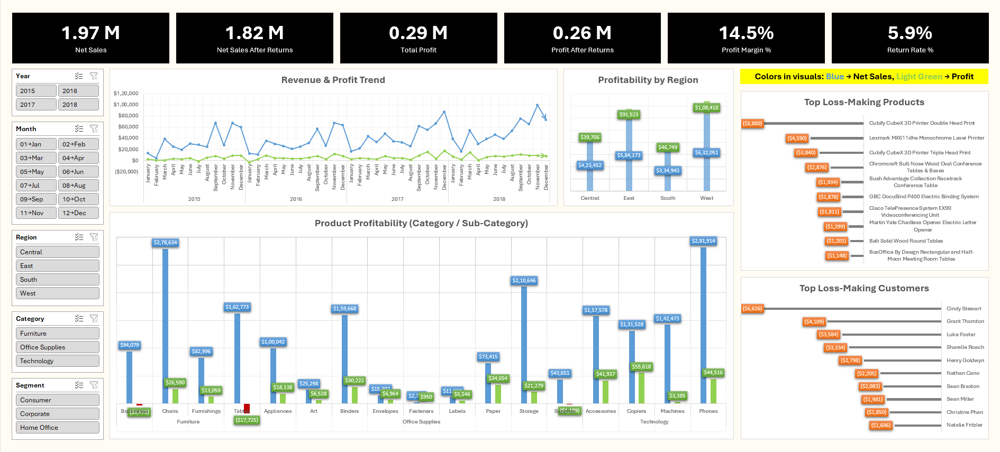

# Operational Performance & Profitability Tracker  
(Excel • Power Query • Power Pivot)

## 📌 Project Overview
This project analyzes **operational performance, profitability, and revenue leakage due to returns** using a publicly available Superstore transactional dataset.

Rather than focusing only on topline revenue, the analysis answers deeper business questions:
- Are we growing profitably or just increasing revenue?
- Which products, customers, and regions drive profits vs losses?
- How much revenue and profit are silently lost due to returns?
- Where should management take corrective action?

The project follows a **production-style Excel analytics pipeline**:  
**Raw Data → Power Query (ETL) → Power Pivot Data Model → DAX Measures → Executive Dashboard**

---

## 🛠 Tech Stack
- **Tool:** Microsoft Excel  
- **Data Transformation:** Power Query (M)  
- **Data Modeling & Measures:** Power Pivot (DAX)  
- **Visualization:** Excel Pivot Charts & Dashboard  
- **Data Source:** Public Superstore dataset (`sample-superstore.xlsx`)

---

## 📂 Data Architecture & Design

### 🔹 Raw Data Layer
- Source Excel file ingested **without modification**
- File: `sample-superstore.xlsx`
- Sheets:
  - Orders
  - Returns
  - People

> Mirrors real-world ingestion pipelines where raw data is never mutated.

---

### 🔹 Fact & Dimension Modeling

| Table Name | Type | Description |
|-----------|------|-------------|
| `fact_orders` | Fact | Sales transactions with financial metrics |
| `fact_returns` | Fact | Returned orders modeled separately |
| `dim_people` | Dimension | Regional ownership (manager by region) |
| `Date` | Dimension | Dedicated calendar table for stable time analysis |

**Key design decisions:**
- Sales and returns are **never mixed**
- Returns modeled as a **separate fact table**
- No forced many-to-many relationships
- Logical linking handled via **DAX (`TREATAS`)**
- Dedicated Date table ensures stable filtering and trends

---

## 🔧 Power Query (ETL) Highlights
All cleaning and transformation logic is handled in **Power Query**, not Excel formulas.

### `fact_orders`
- Data type standardization
- Text cleaning (trimmed fields)
- Business columns created:
  - Discount Amount
  - Net Sales
  - Estimated Cost
  - Profit Margin %

### `fact_returns`
- Clean extraction of returned `Order ID`
- No aggregation or deletion

### `dim_people`
- Region-to-person mapping for reporting

---

## 📐 DAX Measures (Business Logic)
Key measures include:
- Total Net Sales
- Total Profit
- Profit Margin %
- Total Orders
- Returned Orders
- Return Rate %
- Returned Net Sales
- Net Sales After Returns
- Profit After Returns
- Loss-Only Profit (for loss analysis)

All **revenue leakage from returns** is calculated analytically rather than removing data.

---

## 📊 Executive Dashboard

### 🖥 Dashboard Components

#### 🔹 KPI Summary
- Net Sales  
- Net Sales After Returns  
- Total Profit  
- Profit After Returns  
- Profit Margin %  
- Return Rate %

#### 🔹 Core Visuals
- **Revenue & Profit Trend**
- **Profitability by Region**
- **Product Profitability (Category / Sub-Category)**
- **Top Loss-Making Products**
- **Top Loss-Making Customers**

#### 🔹 Slicers
- Year
- Month
- Region
- Category
- Segment

📸 **Dashboard Screenshot:**  

---

## 🔍 Key Business Questions Answered
- Is revenue growth translating into sustainable profit?
- Which regions contribute most to profit vs margin erosion?
- Which products and customers consistently generate losses?
- How much revenue and profit are lost due to returns?
- Where should operational controls be tightened?

---

## 💡 Key Insights
- Revenue growth does not always correlate with profit growth
- Returns cause measurable revenue and profit leakage
- Losses are often concentrated in a small subset of products or customers
- Regional performance varies significantly in margin quality

**Conclusion:**  
Improving **profit quality and return control** can yield higher ROI than focusing solely on topline growth.

---

## 🧠 Skills Demonstrated
- Power Query ETL (M language)
- Fact vs dimension modeling in Excel
- Multi-fact modeling (Orders + Returns)
- DAX measures for executive KPIs
- Revenue leakage & profitability analysis
- Executive dashboard design
- Business-first analytical thinking

---

## 🚀 Future Enhancements
- Month-over-Month / Year-over-Year growth analysis
- Customer lifetime value (CLV)
- Product-level return rate analysis
- RFM segmentation
- Migration to Power BI or SQL warehouse

---

## 👤 Author
**Indranil Bhosale**  
Aspiring Data Analyst  
Excel • Power Query • Power Pivot • Analytics
